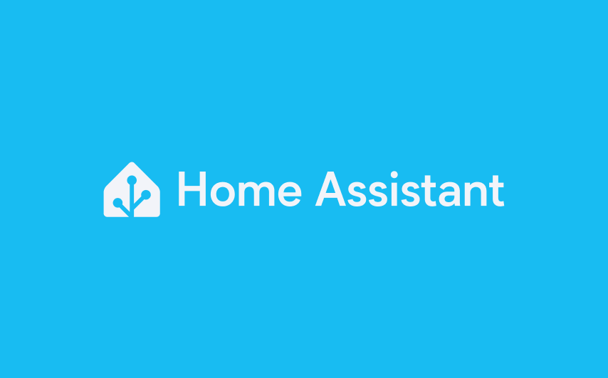
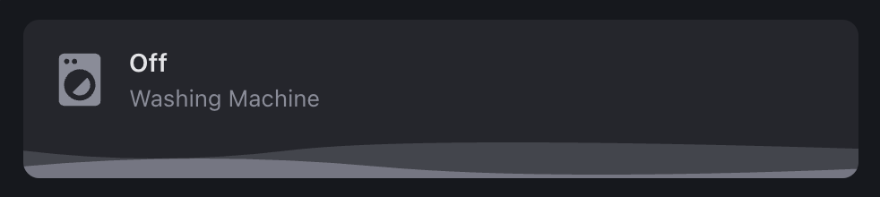
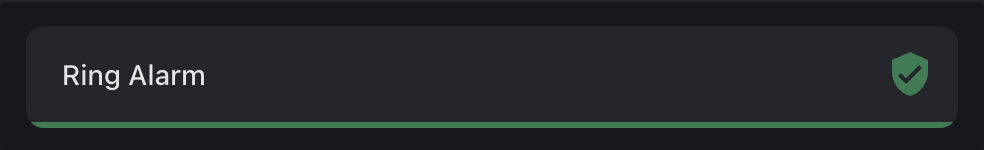
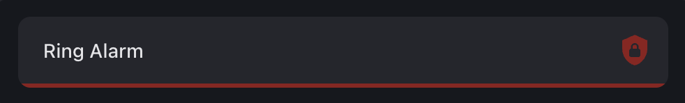

# Home Assistant Custom Cards

This repository features custom dashboard cards that I actively use in my own [Home Assistant](https://www.home-assistant.io/) setup. Designed to streamline the UI and match my personal preferences, each card is built to be effortlessly integrated—no templates or advanced configurations required.

- [Samsung Washing Machine Card](#samsung-washing-machine-card) 🫧
- [Ring Alarm Slim Card](#ring-alarm-slim-card) 🚨

---

## Samsung Washing Machine Card

This card brings your washing machine’s status to life with real-time animations. This card integrates seamlessly with Samsung SmartThings to reflect the current state of your washing machine, displaying whether it’s off, on, or actively washing including a more "human readable" completion time.

### Screenshots

The following images illustrate the card’s appearance in different states:

| Idle State                                                            | Wash State                                                              |
| --------------------------------------------------------------------- | ----------------------------------------------------------------------- |
|  |  |

### Setup Guide

To get started, follow these steps to add the Samsung Animated Washing Machine Card to your Home Assistant dashboard:

1. **Button Card**: Follow the button card [installation guide](https://github.com/custom-cards/button-card).
2. **SmartThings**: Connect your Samsung washing machine through the [SmartThings](https://www.home-assistant.io/integrations/smartthings/) integration.
3. **Custom Card**: Use the YAML configuration stored in [`cards/samsung-washing-machine.yaml`](cards/samsung-washing-machine/card.yaml).

---

## Ring Alarm Slim Card

This card visually displays the current state of your Ring alarm system and allows quick toggling between armed and disarmed modes. Using smooth animations, the card updates in real time to reflect transitions between states, including disarmed, armed (home or away), and arming. The footer animates when arming, providing a dynamic visual indicator.

### Key Features

- **Animated Footer**: Smoothly animates when the alarm is in the "arming" state.
- **Quick Toggle**: Tap to arm when disarmed and to disarm when armed.
- **Color-coded States**: Green for disarmed and armed at home, red for armed away, with dynamic changes based on the alarm state.

### Screenshots

The following images illustrate the card’s appearance in different states:

| Disarmed State                                                          | Arming State                                                        | Armed State                                                       |
| ----------------------------------------------------------------------- | ------------------------------------------------------------------- | ----------------------------------------------------------------- |
|  |  |  |

### Setup Guide

To add the Ring Alarm Slim Card to your Home Assistant dashboard, follow these steps:

1. **Button Card**: Follow the button card [installation guide](https://github.com/custom-cards/button-card).
2. **Ring Integration**: Connect your Ring alarm system through the [Ring integration](https://www.home-assistant.io/integrations/ring/).
3. **Custom Card**: Use the YAML configuration stored in [`cards/ring-alarm-slim/card.yaml`](cards/ring-alarm-slim/card.yaml).
