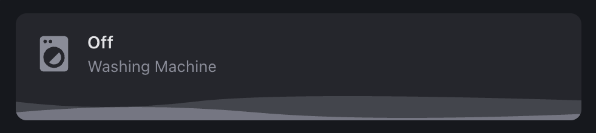
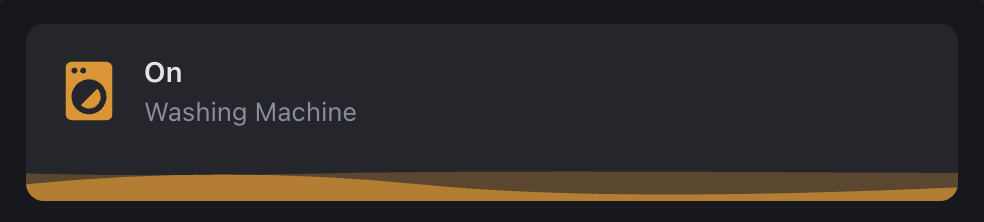
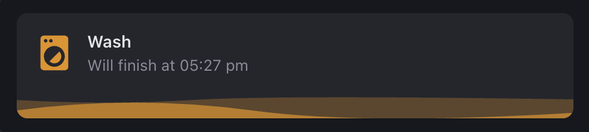

# Home Assistant Custom Cards Collection


This repository features custom dashboard cards that I’ve crafted and actively use in my own [Home Assistant](https://www.home-assistant.io/) setup. Designed to streamline the UI and match my personal preferences, each card is built to be effortlessly integrated—no templates or advanced configurations required. I’m excited to share these with the community, making it easy for anyone to enhance their setup with minimal effort.

---

## Samsung Animated Washing Machine Card

The **Samsung Animated Washing Machine Card** brings your washing machine’s status to life with real-time animations. This card integrates seamlessly with [Samsung SmartThings](https://www.home-assistant.io/integrations/smartthings/) to reflect the current state of your washing machine, displaying whether it’s off, on, or actively washing.

### Card Highlights

- **Animated Status Updates**: Visually indicate the machine’s status with automatic animations for each state—off, on, and washing.
- **Minimal Setup**: Built for quick setup, this card eliminates the need for additional templates, allowing you to focus on functionality rather than configuration.
- **Customizable Design**: Based on the versatile [Button Card](https://github.com/custom-cards/button-card), the card offers easy customization to match your preferred style.

### Screenshots

The following images illustrate the card’s appearance in different machine states:

| Idle State                                    | On State                                    | Wash State                                      |
| --------------------------------------------- | ------------------------------------------- | ----------------------------------------------- |
|  |  |  |

### Setup Guide

To get started, follow these steps to add the Samsung Animated Washing Machine Card to your Home Assistant dashboard:

1. **Install the Button Card**: Follow the [Button Card installation guide](https://github.com/custom-cards/button-card).
2. **Set Up SmartThings Integration**: Connect your Samsung washing machine to Home Assistant through the SmartThings integration.
3. **Add the Custom Card**: Use the YAML configuration stored in [`cards/samsung-washing-machine.yaml`](cards/samsung-washing-machine.yaml) to add the card to your dashboard.

```yaml
   type: custom:button-card
   entity: sensor.washing_machine
   name: Samsung Washing Machine
   state:
     - value: 'off'
       ...
```
